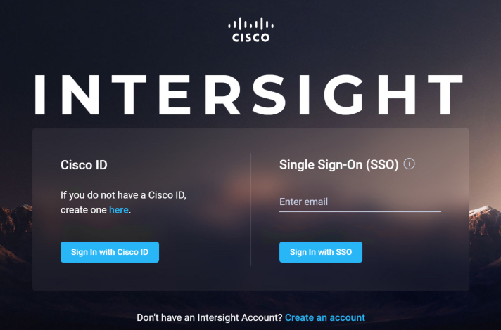

# Introduction to the Cisco Intersight REST API

This Introduction to the Intersight REST API Learning Lab will guide you through creating an Intersight account, claiming a UCS Devices, and creating Intersight REST API keys.

## Objectives

After completing this lab you will know:

- How to create an Intersight account
- How to claim UCS devices in Intersight
- How to create Intersight API keys
- The available Intersight developer tools
- How to remove claimed devices from Intersight

## Prerequisites
Prior to starting this learning lab, it helps to understand basic Intersight functionality.

## Intersight REST API documentation
Documentation for Cisco Intersight REST API is available at  [intersight.com](https://intersight.com/apidocs/introduction/overview/).

### Learning Lab infrastructure requirements
All the exercises in the Introduction to the Cisco Intersight REST API Learning Lab can be completed using the [Cisco Intersight Sandbox](https://devnetsandbox.cisco.com/RM/Diagram/Index/a63216d2-e891-4856-9f27-309ca61ec862?diagramType=Topology).

## Step 1: Claim a UCS device in Intersight

### Connect to UCS Manager to retrieve device ID and claim code
1. Click the Chrome icon on the Taskbar: 
1. Browse to [https://10.10.20.40]()
1. Login:
   - Username - `admin`
   - Password - `password`
1. Go to **Admin-->Device Connector**. You'll need the **Device ID** and **Claim Code** to claim this device in **Intersight**.

   

### Connect to Cisco Intersight to claim the UCS device
1. Connect to Intersight
1. Open a new tab in Chrome
1. Browse to [intersight.com]()
1. Login with your Cisco ID. (If you do not have a Cisco ID you can follow these [instructions](https://idreg.cloudapps.cisco.com/idreg/register.do) to create one.)

     

1. After succesfull login, click **Create an Account**.
1. Scroll to the bottom of **Offer Description**.
1. Click the **I accept** checkbox.
1. Enter an **Account Name**.
1. Enter a **Device ID**. 
1. Enter a **Claim Code**.
1. Click **Create**.
1. Click **Log me in**.

Remember the `Device ID` and `Claim Code` are in the UCS Manager UI under **Admin-->Device Connector**.

    
    
    
    
    

### Create Intersight API keys

Intersight *API keys* are a two part keys; an *API key ID* and a *secret key*. The API Key ID is a multi-character string always visible after initial key creation. The secret key is an **RSA Private Key** that is only available at API Key creation.

To Create Cisco Intersight API keys in Intersight:

1. Click the **Settings** icon.
1. Click **API Keys** in the left-hand navigation pane.
1. Click **Generate API Key**. 
1. Enter a **Description** for the key
1. Click **Generate**.
1. Click the **Save Secret Key to text file** icon.

      
      
      
      
      

A file named "SecretKey.txt" is downloaded to your default downloads location. In the DevNet Intersight Sandbox, the file will be downloaded to `C:\Users\administrator\Downloads\SecretKey.txt`.

### Activate the Intersight essentials license evaluation

Intersight currently has two editions of functionality, **Base** and **Essentials**. The Cisco Intersight REST API Learning Labs require features of the **Essentials** edition.

- Base Features

    - Supports Cisco UCS and HyperFlex Systems
    - Global inventory and health status
    - Tagging and basic global search
    - Context-launch of element managers
    - Cisco HyperFlex installation
    - User customizable dashboard
    - Automated collection of tech support files for UCS Systems

- Essentials Features

    - All functionality of Base
    - Cisco UCS C-Series management
    - Policy-based configuration through Service Profiles
    - Detailed inventory and server actions
    - Firmware Management
    - Virtual Keyboard-Video-Mouse (vKVM)
    - Server HCL compliance check

New features are continually being added to both editions.

You must activate the **Essentials** edition to complete the Cisco Intersight Learning Labs as they use the Cisco Intersight REST API to perform actions that are part of the **Essentials** edition. If you already are in an evaluation period for your Intersight account or have an **Essentials** license you can skip this step.

1. Activate the **Essentials** Evaluation License.

  - ***Navigate*** to "Settings-->License"
  - ***Click*** the "Start Evaluation" button under the **Essentials** "Feature" list
  - ***Click*** the "Start" button on the "Start Evaluation 90 Days" dialog  

  The **Essentials** license is now active.

    
    
    

Next Step: Exploring the Cisco Intersight Developer Tools.
