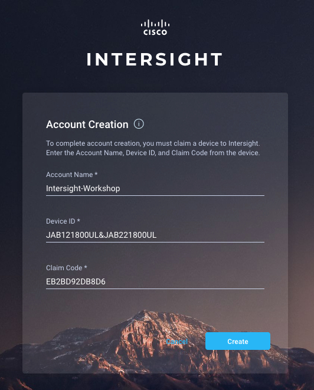

# Introduction to the Cisco Intersight REST API

This Introduction to the Intersight REST API Learning Lab will guide you through creating an Intersight account, claiming a UCS Devices, and creating Intersight REST API keys.

## Objectives

After completing this lab you will know:

- How to create an Intersight account
- How to claim UCS devices in Intersight
- How to create Intersight API keys
- The available Intersight developer tools
- How to remove claimed devices from Intersight

## Prerequisites
Prior to starting this learning lab, it helps to understand basic Intersight functionality.

## Intersight REST API Documentation
Documentation for Cisco Intersight REST API is available at  [intersight.com](https://intersight.com/apidocs/introduction/overview/).

### Learning Lab infrastructure requirements
All the exercises in the Introduction to the Cisco Intersight REST API Learning Lab can be completed using the [Cisco Intersight Sandbox](https://devnetsandbox.cisco.com/RM/Diagram/Index/a63216d2-e891-4856-9f27-309ca61ec862?diagramType=Topology).

# Step 1: Claim a UCS Device in Cisco Intersight

### Connect to UCS Manager to retrieve Device ID and Claim Code
1. Connect to UCS Manager

  - ***Click*** the Chrome icon on the Taskbar   
  - ***Browse*** to [https://10.10.20.40]()
  - ***Login***
    - Username - `admin`
    - Password - `password`
  - ***Navigate*** to "Admin-->Device Connector"

    You'll need the **Device ID** and **Claim Code** to claim this device in **Intersight**.

      

### Connect to Cisco Intersight to Claim the UCS Device
1. Connect to Cisco Intersight

  - ***Open*** a new tab in Chrome
  - ***Browse*** to [intersight.com]()
  - ***Login*** with your Cisco ID  

  If you do not have a Cisco ID you can follow these [instructions](https://idreg.cloudapps.cisco.com/idreg/register.do) to create one.

    

2. Create an Intersight Account and Claim a the UCS Device

  After succesfull login to intersight.com

  - ***Click*** "Create an Account"
  - ***Scroll*** to the bottom of the "Offer Description"
  - ***Click*** the "I accept" Checkbox
  - ***Enter*** an "Account Name"
  - ***Enter*** a "Device ID"
  - ***Enter*** a "Claim Code"
  - ***Click*** "Create"
  - ***Click*** "Log me in"  

  Remember the **Device ID** and **Claim Code** are in the UCS Manager UI under "Admin-->Device Connector"

    
    
    
    
    

### Create Cisco Intersight API Keys

Cisco Intersight **API Keys** are a two part Key; an *API Key ID* and a *Secret Key*. The API Key ID is a multi-character string that is always visible to you after initial key creation. The Secret Key is an **RSA Private Key** that is only available at API Key creation.

1. Create Cisco Intersight API Keys, in Intersight

  - ***Click*** the "Settings" icon
  - ***Click*** "API Keys" in the left-hand navigation
  - ***Click*** the "Generate API Key" button
  - ***Enter*** a Description for the Key
  - ***Click*** the "Generate" button
  - ***Click*** the "Save Secret Key to text file" icon

      
      
      
      
      

  A file named "SecretKey.txt" will be downloaded to your default downloads location for your browser. In the DevNet Intersight Sandbox, the file will be downloaded to `C:\Users\administrator\Downloads\SecretKey.txt`

### Activate the Cisco Intersight Essentials License Evaluation

Cisco Intersight currently has two editions of functionality, **Base** and **Essentials**. The Cisco Intersight REST API Learning Labs require features of the **Essentials** edition.

- Base Features

    - Supports Cisco UCS and HyperFlex Systems
    - Global inventory and health status
    - Tagging and basic global search
    - Context-launch of element managers
    - Cisco HyperFlex installation
    - User customizable dashboard
    - Automated collection of tech support files for UCS Systems

- Essentials Features

    - All functionality of Base
    - Cisco UCS C-Series management
    - Policy-based configuration through Service Profiles
    - Detailed inventory and server actions
    - Firmware Management
    - Virtual Keyboard-Video-Mouse (vKVM)
    - Server HCL compliance check

New features are continually being added to both editions.

You must activate the **Essentials** edition to complete the Cisco Intersight Learning Labs as they use the Cisco Intersight REST API to perform actions that are part of the **Essentials** edition. If you already are in an evaluation period for your Intersight account or have an **Essentials** license you can skip this step.

1. Activate the **Essentials** Evaluation License.

  - ***Navigate*** to "Settings-->License"
  - ***Click*** the "Start Evaluation" button under the **Essentials** "Feature" list
  - ***Click*** the "Start" button on the "Start Evaluation 90 Days" dialog  

  The **Essentials** license is now active.

    
    
    

Next Step: Exploring the Cisco Intersight Developer Tools.
