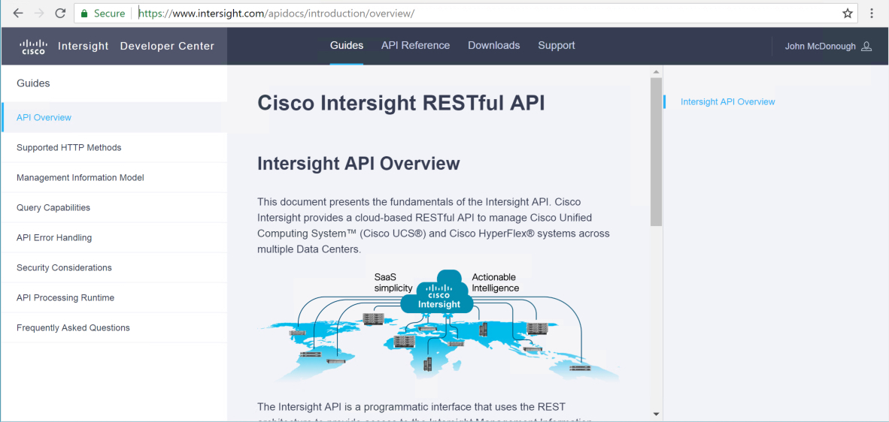
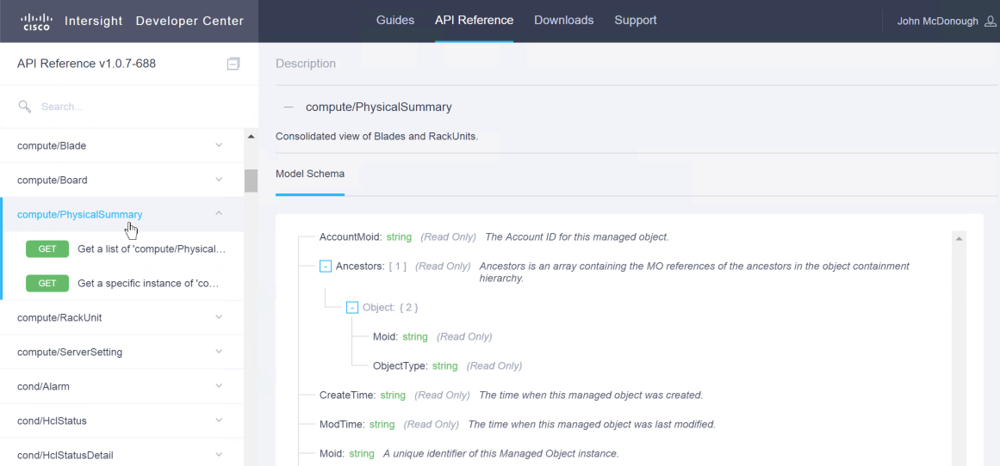
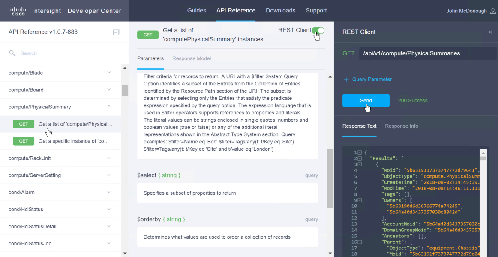
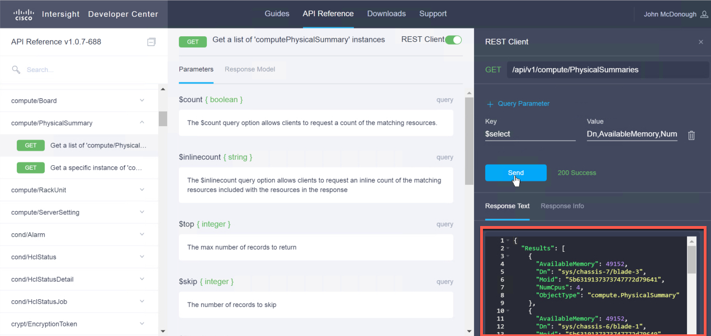
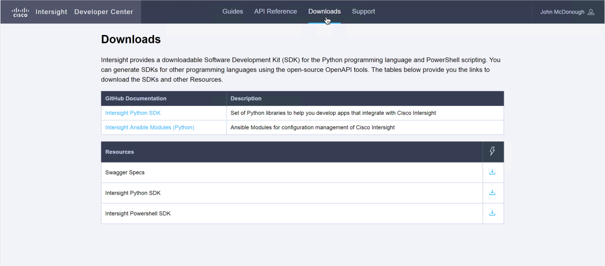
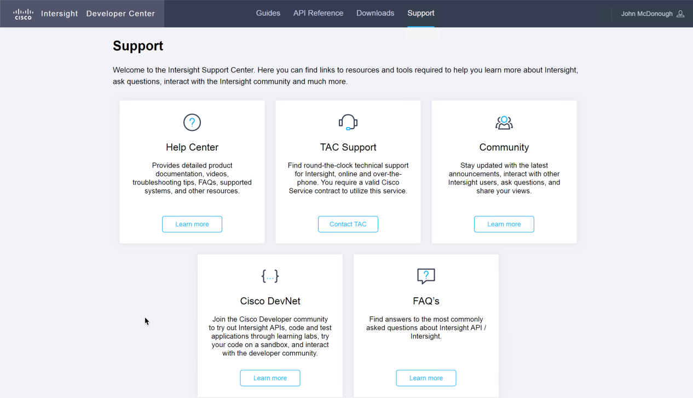

# Step 2: Explore the Cisco Intersight Developer Tools

### Cisco Intersight REST API Developer Tools

1. View the Intersight REST API Documentation

  - ***Browse*** to `https://www.intersight.com/apidocs`  

  The Intersight REST API guide documents all aspects of the Intersight RESTful API, from supported HTTP methods to FAQs. Be sure to take a look at the sections to familiarize yourself with section's content.

      

2. View the API Reference

  - ***Click*** the "API Reference" heading in the top navigation.  

  When you are logged in to Intersight, the API Reference is active and can be utilized with objects in your Intersight account.

  - ***Scroll*** the left-hand resource group navigation to `compute/PhysicalSummary`
  - ***Click*** the `compute/PhysicalSummary` title to expand the section.  

  When the resource group title is clicked the right-side panel is populated with the "Model Schema" for an object of the selected resource. The "Model Schema" describes the structure and attributes the object

      

3. Use the REST Client in the API Reference to access objects in your Intersight account.

  - ***Click*** the first **GET** request listed under `compute/PhysicalSummary`
  - ***Click*** the "REST Client" slider in the upper-right of the **GET** request description (if it is not already activated - green)
  - ***Click*** the "SEND" button in the REST Client.  

  The **GET** request "Response Text" is displayed.

      

  All the attributes of all the objects in the `compute/PhysicalSummaries` resource group are displayed.

4. Use the REST Client in the API Reference to access specific object attributes.

  Using the same **GET** request add "Query Parameters" to limit the returned object attributes to:

    - Dn
    - AvailableMemory
    - NumCpus

  - ***Click*** "+ Query Parameter"
  - ***Enter*** `$select` in the "Key" field
  - ***Enter*** `Dn,AvailableMemory,NumCpus` in the "Value" field
  - ***Click*** the "SEND" button  

  The response text showing only the specified attributes is displayed.

      

5. View the Intersight Downloads

  - ***Click*** the "Downloads" heading in the top navigation.  

  Here you can access the github.com repositories for the Intersight Python SDK and the Intersight Ansible modules.

  You can also download

    - The Swagger Specs
    - The Intersight Python SDK
    - The Intersight PowerShell SDK  

    

6. View the Support available for Intersight

  - ***Click*** the "Downloads" heading in the top navigation.  

  Here you can access the available support options for Intersight.

    

Now that you have created an Intersight account, claimed devices to Intersight and created your Intersight API Keys, try the Intersight REST API with Postman and the Intersight REST API with Python.

Next Step: Removing Claimed UCS Devices from Intersight
