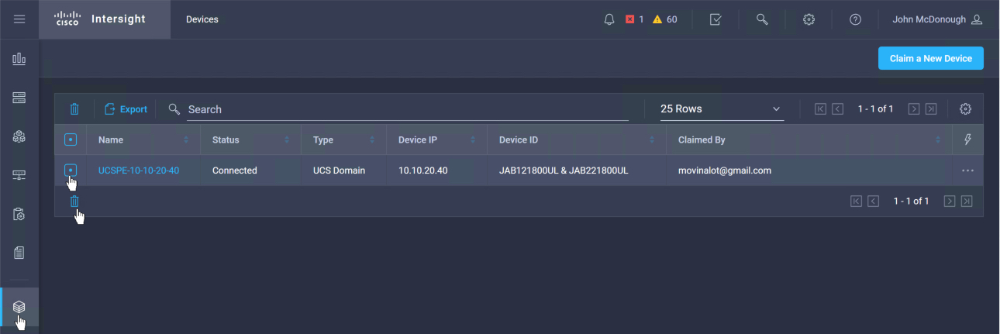
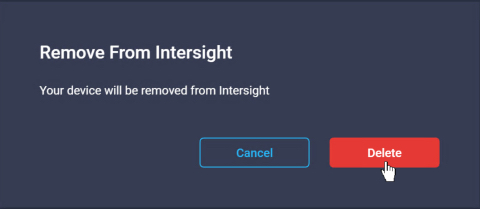
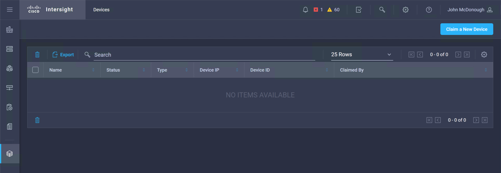

# Step 3: Remove Claimed UCS Devices from Intersight

## **Important Step - Please Review**
### Cisco Intersight Device Removal

Cisco Intersight is a **Production** cloud-based platform with a very large number of users. You have been learning how to use Cisco Intersight with the **actual platform**. Please remove your claimed Intersight Sandbox devices, if you are not going to utilize them further.

If you are done using the Cisco Intersight DevNet Sandbox please be sure to follow the steps here to remove the Devices you **claimed** during these labs.

If you are going to continue on to the other Cisco Intersight REST API Learning Labs, these devices are used in those Learning Labs as well. Do not remove them from your Intersight Account

- Introduction to the Cisco Intersight REST API with Postman
- Introduction to the Cisco Intersight REST API with Python

1. Remove the Claimed UCS Devices from Intersight

  - ***Browse*** to `https://www.intersight.com`
  - ***Click*** the "Devices" icon
  - ***Click*** the checkbox next to the UCS Device
  - ***Click*** the garbage can icon
  - ***Enter*** the "Delete" button  

    
    
    

  The claimed UCS Device is now removed from your Intersight account.

**Congratulations! You've Completed, Introduction to the Cisco Intersight REST API**
