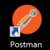
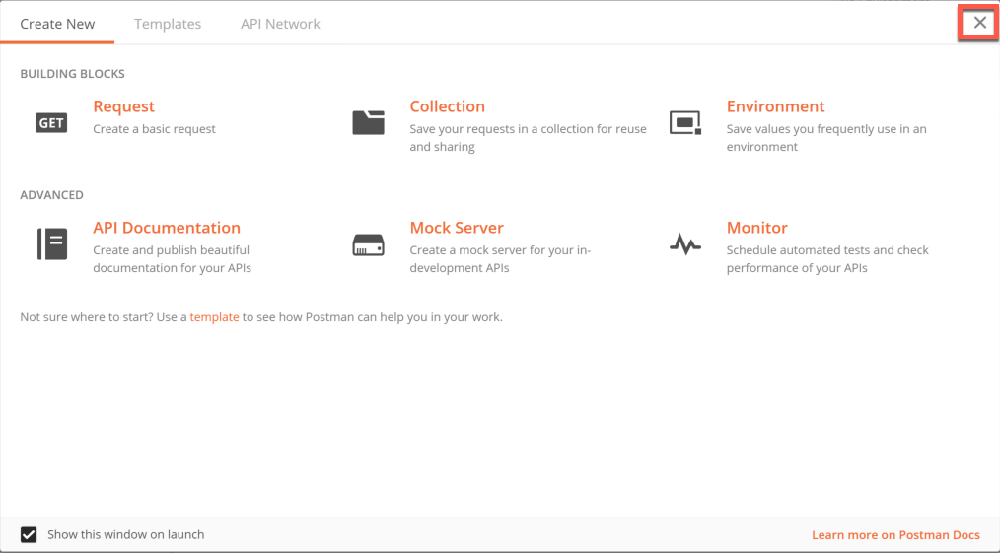
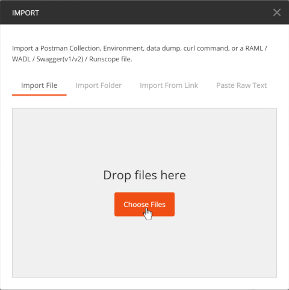
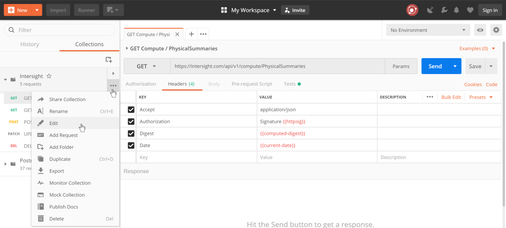

# Introduction to the Cisco Intersight REST API with Postman

This introduction to the Intersight REST API with Postman Learning Lab guides you through using Postman to perform queries, updates and configuration with Intersight.

## Objectives
After completing this lab you will know:

- How to a Use a Postman collection to interact with Intersight REST APIs.
- How to remove claimed devices from Intersight.

## Prerequisites
Prior to starting this learning lab, it helps to understand basic Intersight functionality.

An understanding of REST, JSON and a bit of JavaScript would also be helpful.

## Cisco Intersight REST API Documentation
Documentation for the Intersight REST API is available at [intersight.com](https://intersight.com/apidocs/introduction/overview/).

## Learning Lab Infrastructure Requirements
All the exercises in the Introduction to the Intersight REST API with Postman Learning Lab can be completed using the [Intersight Sandbox](https://devnetsandbox.cisco.com/RM/Diagram/Index/a63216d2-e891-4856-9f27-309ca61ec862?diagramType=Topology).

## Step 1: Import a Postman collection

### Git the Postman collection from Github
If you have recently completed the **Cisco Intersight REST API with Python** Learning Lab and are using the same DevNet Intersight Sandbox, then you already have the Postman Intersight REST API collection in the `C:\Users\administrator\Desktop\intersight-rest-api` directory.

The Postman Intersight REST API collection file is named, `intersight.postman_collection.json`. If this collection has not already been imported into Postman:

1. Launch **Git Bash** to clone the Github repository for this Learning Lab's code.
1. Double-click the **Git Bash** shortcut on the desktop 
1. On the he command line, enter `cd Desktop` to change directory to the Administrator's Desktop.
1. Enter `git clone https://github.com/movinalot/intersight-rest-api` to download the Intersight REST API Postman collection.

You have created a directory named `intersight-rest-api` and downloaded into it the Intersight REST API Postman collection along with the Python source code files for the Cisco Intersight REST API with Python Learning Lab. You only need the Postman Collection for this Learning Lab. If you follow-up this lab with the Cisco Intersight REST API with Python Learning Lab you do not have to re-clone the `intersight-rest-api` repository.

   <br/><br/>

### Import the Intersight REST API collection into Postman
In some instances the Postman application will seem to take a long time to load. It should load in less that 1-2 minutes.  If you experience a blank Postman screen for more than 2 minutes, close Postman and try launching the Postman application again.

To import the collection into Postman:

1. Double-click the **Postman** shortcut on the desktop 
1. Click the **X** in the upper-left corner of the Postman welcome screen (if it appears).
1. Click **Import** on the upper-left.
1. Click **Choose Files** in the **IMPORT** dialog window.
1. Navigate to `C:\Users\Administrator\Desktop\intersight-rest-api`.
1. Select `intersight.postman_collection.json`.
1. Click **Open**.You have imported the collection

   
  
   
  
   
  
   

1. View the contents of the Collection. Click the "Twistie" next to the Intersight collection.
1. Click each request in the Collection and view the **Header**, **Body**, and **Tests** associated with the request. Not all requests have all these components. If present, these components will be indicated by a green number in parentheses, as is the case for **Headers**, or by a green dot, as is the case for **Body** and **Test**.

   

### Headers
  
The Collection has two REST API `GET` requests, and one each of a `POST`, `PATCH`, and `DELETE` requests. Each one of these requests is prepopulated with the following headers:
- Accept
- Authorization
- Digest
- Date

The `POST` and `PATCH` requests each have an additional header:
- Content-Type

The POST headers:
  


### Tests
The `GET` Compute/PhysicalSummaries, `POST` NTP Policy and `DELETE` NTP Policy have post-request tests associated with the REST API request. The tests are written in JavaScript and allow interaction/inspection of the response generated from the request, as well as manipulating the Postman **Environment** and **Global** variables.

#### GET Compute/PhysicalSummaries Tests

    ```JavaScript
    if (responseBody.length > 0) {
      var jsonData = JSON.parse(responseBody);
      for (var i = 0; i < jsonData.Results.length; i++) {
        var object = jsonData.Results[i];
        console.log(
          object.Dn,
          "AvailableMemory: " + object.AvailableMemory,
          "NumCpus: " + object.NumCpus
        );
      }
    }
    ```

**What it does:** If there is a `responseBody` from the `GET`, convert it to JSON and log to the console, the Dn, AvailableMemory, and NumCpus of the physical compute device.

#### POST NTP Policy Tests

    ```JavaScript
    var respJsonData = JSON.parse(responseBody)

    if (respJsonData.Moid) {
      pm.globals.set("ntp-policy", respJsonData.Moid)
    }
    ```

**What it does:** Convert the `responseBody` from the `POST` to JSON and set the Postman global variable `ntp-policy` to the Managed Object ID (`Moid`) of the just created `NTP Policy`.

#### DELETE NTP Policy Tests

    ```JavaScript
    pm.globals.unset("ntp-policy");
    ```

**What it does:** Unsets the Postman global variable `ntp-policy` by removing the `Moid` of the NTP Policy created with the `POST` and updated by the `PATCH`.

### Body

The `POST` and `PATCH` requests have a JSON-encoded "body" used to create and update an NTP Policy.

#### POST body

The `POST` body creates the NTP Policy named `ntp-policy`, sets the description and provides a list of NTP Servers that `ntp-policy` should use for NTP Services.

    ```json
    {
      "Enabled":true,
      "Name":"ntp-policy",
      "Description":"NTP Policy for ntp.org",
      "NtpServers":["pool.ntp.org"],
      "Tags":[]
    }
    ```

#### PATCH body

The `PATCH` body supplies the list of NTP Servers `ntp-policy` updates.
    
    ```json
    {
      "NtpServers":["pool.ntp.org", "10.10.10.30"]
    }
    ```
    
### View more components of the Intersight REST API Postman collection

The collection also has a **Pre-request** script run prior to any request being sent to the Intersight service. The **Pre-request** script creates the signed digest that is the REST API call.

Intersight is highly secure, as any REST API interaction relies upon the API key ID and secret key (as created earlier in this lab) used to sign the request.

A [SHA256](https://en.wikipedia.org/wiki/SHA-2) digest of the body data (if there is any) and headers of the request are **signed** with the API Keys.

#### Access the pre-resquest script

1. Hover over the lower-right corner of the **Intersight Collection** heading and **three dots** will appear.
1. Click the **three dots** to access a drop-down menu.
1. Click **Edit**.

   

1. Click the **Pre-request Scripts** header to view it.

   <br/><br/>

#### View the collection tests

Collection tests are run for every request, whereas the request tests you viewed earlier are only run for the specific request to which they are associated. To view collection tests, click the **Tests** header. 

  <br/><br/>

#### Next Step: Using a Postman collection to interact with Intersight
