# Step 2: Import a Postman Collection to Interact with Cisco Intersight

### Git the Postman Collection form Github
If you have recently completed the **Cisco Intersight REST API with Python** Learning Lab with this environment, then you already have the Postman Intersight REST API Collection in the `C:\Users\administrator\Desktop\intersight-rest-api` directory.

The Postman Intersight REST API Collection file is named, `intersight.postman_collection.json`

1. Launch **Git Bash**

  - ***Double-Click*** the **Git Bash** shortcut on the desktop 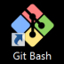

  - ***Enter*** on the command line `cd Desktop` to change directory to the Administrator's Desktop
  - ***Enter*** on the command line the `git` command below to download the Intersight REST API Postman Collection.

    `git clone https://github.com/movinalot/intersight-rest-api`

    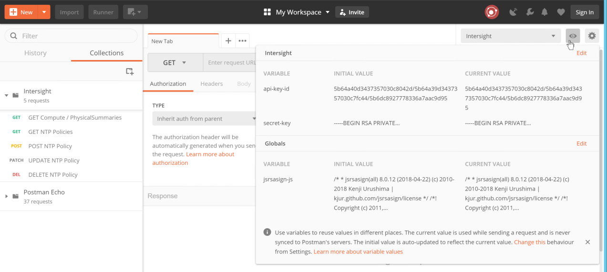<br/><br/>

    You have created a directory named `intersight-rest-api` and downloaded into it the Intersight REST API Postman Collection along with the Python source code files for the Cisco Intersight REST API with Python Learning Lab. You only need the Postman Collection for this Learning Lab. If you follow-up this lab with the Cisco Intersight REST API with Python Learning Lab you do not have to re-clone the `intersight-rest-api` repository.

### Import the Intersgiht REST API Postman Collection
In some instances the Postman application will seem to take a long time to load. It should load in less that 1-2 minutes.  If you experience a blank Postman screen for more than 2 minutes, close Postman and try launching the Postman application again.

1. Launch the Postman application and Import a Collection

  - ***Double-Click*** the **Postman** shortcut on the desktop 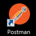
  - ***Click*** the "X" in the upper-left corner of the Postman Welcome screen (if it appears)
  - ***Click*** the "Import" button on the upper-left
  - ***Click*** the "Choose Files" button in the "IMPORT" dialog window
  - ***Navigate*** to `C:\Users\Administrator\Desktop\intersight-rest-api`
  ***Select*** the file `intersight.postman_collection.json`
  - ***Click*** the "Open" button

    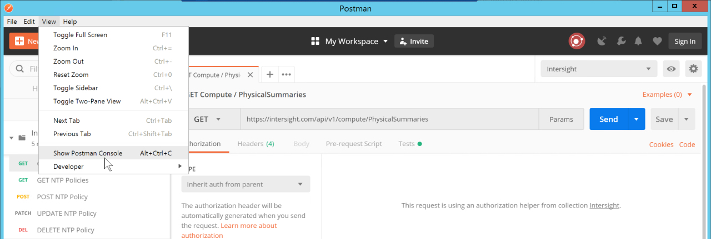<br/><br/>
    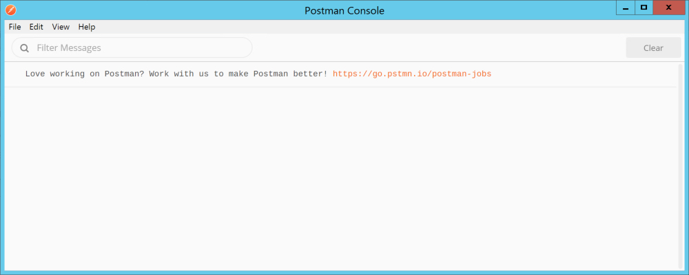<br/><br/>
    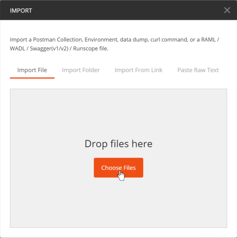<br/><br/>
    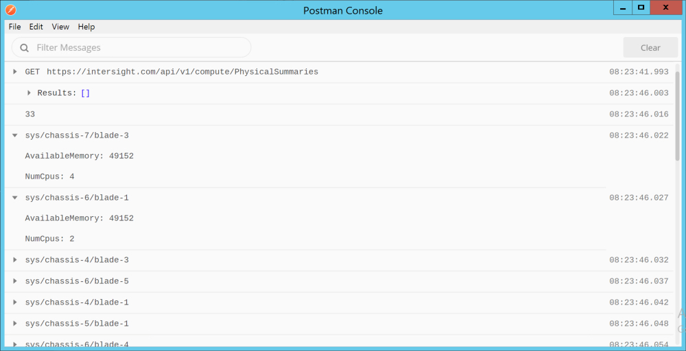<br/><br/>

2. View the contents of the Collection

  - ***Click*** the "Twistie" next to the Intersight collection.

    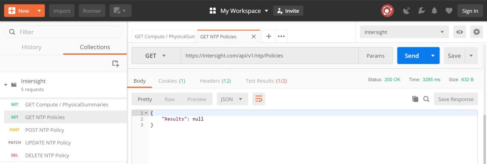<br/><br/>

    - ***Click*** on each request in the Collection and view the "Header", "Body", and "Tests" associated with the request.  Not all requests have all these components. If present these components will be indicated by a green number in parentheses, as is the case for "Headers" or by a green dot, as is the case for "Body" and "Tests".

    ### Headers

    The Collection has two GET REST API requests, and one each of a POST, PATCH, and DELETE REST API request. Each one of these requests is pre-populated with the following Headers.

      - Accept
      - Authorization
      - Digest
      - Date

    The POST and PATCH have an additional header

      - Content-Type<br/><br/>

    The POST Headers:
    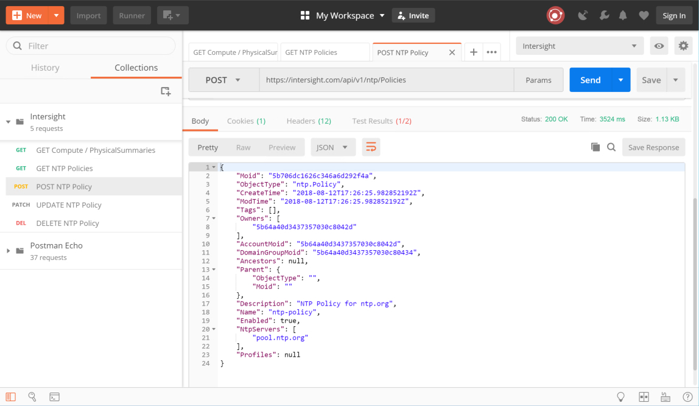<br/><br/>

    ### Tests

    The GET Compute / PhysicalSummaries, POST NTP Policy and DELETE NTP Policy have post-request "Tests" associated with the REST API request.

    The "Tests" are written in JavaScript and allow interaction/inspection of the response that was generated from the request. As well the "Tests" allow for manipulation of the Postman **Environment** and **Global** variables.

    GET Compute / PhysicalSummaries Tests:
    ```JavaScript
    if (responseBody.length > 0) {
      var jsonData = JSON.parse(responseBody);
      for (var i = 0; i < jsonData.Results.length; i++) {
        var object = jsonData.Results[i];
        console.log(
          object.Dn,
          "AvailableMemory: " + object.AvailableMemory,
          "NumCpus: " + object.NumCpus
        );
      }
    }
    ```

    If there is a `responseBody` from the `GET`, convert it to JSON and log to the console, the Dn, AvailableMemory, and NumCpus of the physical compute device.

    POST NTP Policy Tests:
    ```JavaScript
    var respJsonData = JSON.parse(responseBody)

    if (respJsonData.Moid) {
      pm.globals.set("ntp-policy", respJsonData.Moid)
    }
    ```

    Convert the `responseBody` from the **POST** to JSON and set the Postman global variable `ntp-policy` to the `Moid` of the just created `NTP Policy`.

    DELETE NTP Policy Tests:
    ```JavaScript
    pm.globals.unset("ntp-policy");
    ```

    Unset the Postman global variable `ntp-policy`. Removing the `Moid` of the NTP Policy created with the POST and updated by the PATCH.

    ### Body
    The POST and PATCH requests have a JSON encoded "Body" that is used to create and update an NTP Policy.

    POST Body:
    ```json
    {
      "Enabled":true,
      "Name":"ntp-policy",
      "Description":"NTP Policy for ntp.org",
      "NtpServers":["pool.ntp.org"],
      "Tags":[]
    }
    ```

    The POST Body creates the NTP Policy named `ntp-policy`, sets the description and provides a list of NTP Servers that `ntp-policy` should use for NTP Services.

    PATCH Body:
    ```json
    {
      "NtpServers":["pool.ntp.org", "10.10.10.30"]
    }
    ```

    The PATCH Body supplies the list of NTP Servers that `ntp-policy` should be updated to.

### View More Components of the Intersgiht REST API Postman Collection
The collection also has a pre-request script that is run prior to any request being sent to the Intersight service. The pre-request script creates the signed digest that is the REST API call.

Intersight is highly secure, any REST API interaction relies upon the API Key ID and Secret Key that you created earlier in this lab. The API Keys are used to sign the request.

In a very basic sense a [SHA256](https://en.wikipedia.org/wiki/SHA-2) digest of the Body data (if there is any) and headers of the request are **signed** with the API Keys.

1. Access the Pre-resquest script.

  - ***Hover*** over the lower-right corner of the Intersight Collection heading **three dots*** will appear.
  - ***Click*** the **three dots** to access a drop-down menu,
  - ***Click*** "Edit"

    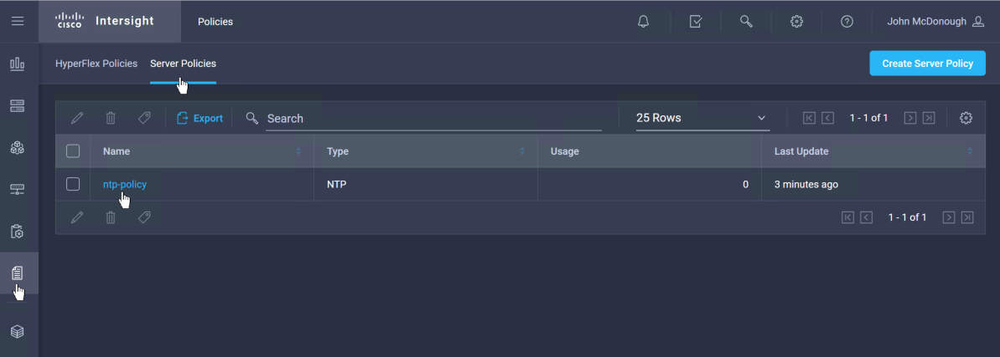<br/><br/>

2. View the Pre-request Script

  - ***Click*** the header "Pre-request Scripts"

    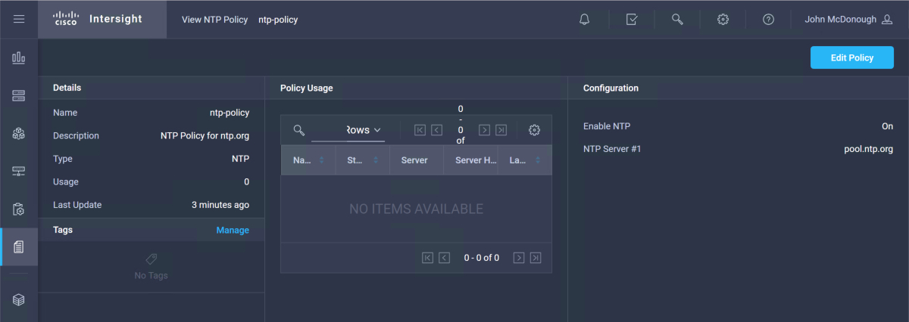<br/><br/>

3. View the Collection Tests

  Collection Tests are run for every request, where as the request Tests you viewed earlier are only run for the specific request to which they are associated.

  - ***Click*** the header "Tests"

    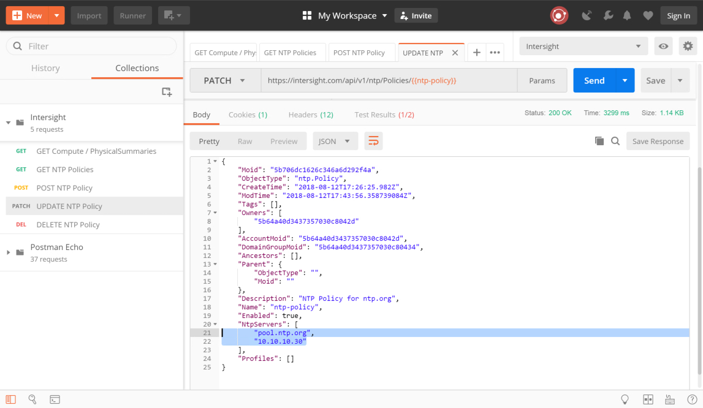

Next Step: Using a Postman Collection to Interact with Cisco Intersight.
