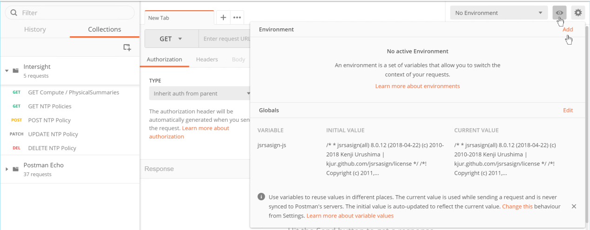
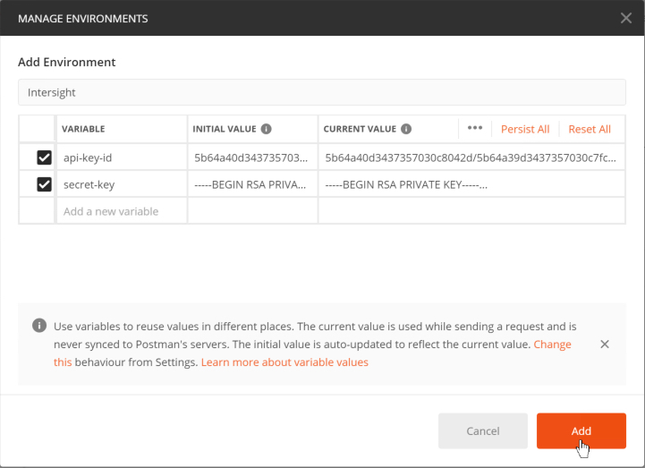
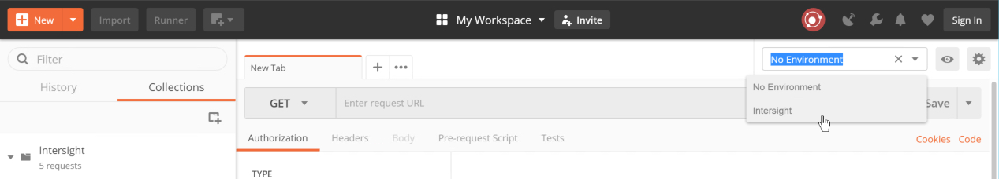
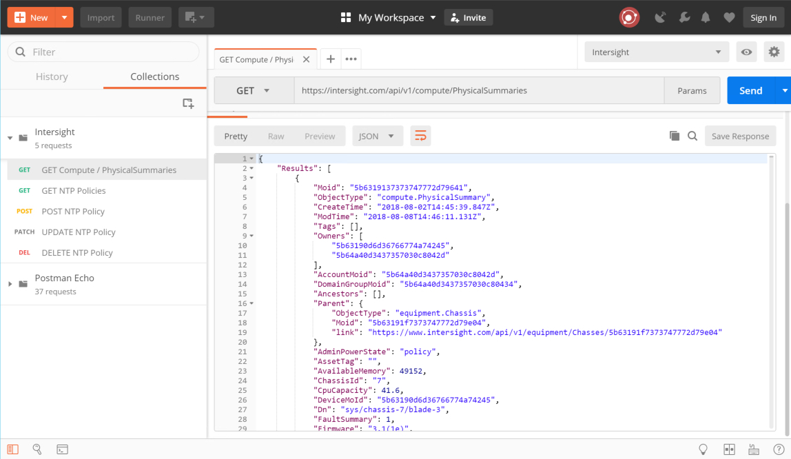

# Step 2: Use a Postman Collection to Interact with Cisco Intersight

### Create an Intersight Environment in Postman
The imported Intersight REST API Postman Collection is almost ready to be used.  You'll need to create a **Postman Environment** and populate two environment variables in order to make Intersight REST API calls via Postman.

1. Create a Postman Environment for Intersight

  - ***Click*** the "Eye" icon in the upper-right of the Postman interface.
  - ***Click*** "Add" in the upper-right of the "Environment" section.
  - ***Enter*** "Intersight" in the "Environment Name" field  

    

2. Create Environment Variables for your REST API Keys

  - ***Enter*** the variable name `api-key-id` in the "VARIABLE" field.
  - ***Enter*** your **API Key ID** in the "INITIAL VALUE" field.  

  The API Key ID is found under "Settings-->API Keys" in the Intersight interface.

  - ***Enter*** the variable name `secret-key` in the "VARIABLE" field.
  - ***Enter*** the entire contents of the `SecretKey.txt` file in the "INITIAL VALUE" field.  

  The `SecretKey.txt` file is located in the directory `C:\Users\administrator\Downloads`. This file was downloaded when you created the API Keys in Intersight.

  - ***Click*** the "Add" button to create and save the environment.  

    

  - ***Click*** the "X" in the upper-right of the "MANAGE ENVIRONMENTS" dialog.

### View the Intersight REST API Environment and open the Postman Console.

1. Select the Intersight Environment

  - ***Click*** the drop-down in the upper-right with the text "No Environment"
  - ***Select*** the "Intersight" environment  

    

2. View the Intersight Environment variables

  - ***Click*** the "Eye" icon in the upper-right.  

    

All of the Intersight requests with output to the Postman Console.

3. Open the Postman console

  - ***Click*** the "View" menu
  - ***Click*** the "Show Postman Console" menu item  

    
    

With the Intersight Postman Environment created and Postman Console open you can now run the Intersight REST API requests and view results of the REST API calls.

### Intersight REST API Requests

##### Make a GET Request
1. Run the GET request for GET Compute / PhysicalSummaries

  - ***Click*** the **GET** request labeled `GET Compute / PhysicalSummaries`  

  Notice the request Uri

  - `https://intersight.com/api/v1/compute/PhysicalSummaries`  

  The **GET** request is a query of the `compute/PhysicalSummaries` Intersight resource. The response is a JSON encoded listing of every Intersight managed compute resource in your account.

  - ***Click*** the "SEND" button  

2. View the results in the Postman Interface and the Postman Console.

  - You can scroll through the results and view the `Moid` Managed Object ID for each compute resource. As well you can view a variety of attributes for each compute resource in your account.  

    

  - The Postman Console was populated by both the Collect "Tests" and the GET request "Tests". View the JavaScript in the "Tests" to see how the individual resource attributes were accessed.  

    

3. Run the GET request for GET NTP Policies

  - ***Click*** the **GET** request labeled `GET NTP Policies`  

Notice the request Uri

  - `https://intersight.com/api/v1/ntp/Policies`  

  The **GET** request is a query of the `ntp/Policies` Intersight resource. The response is a JSON encoded listing of every Intersight managed NTP Policy resource in your account.

  - ***Click*** the "SEND" button  

  The results of this query is a JSON encoded list of all the NTP Policies in your Intersight account, if any. If there are not any NTP Policies the the JSON encoded response is a null "Results" list.

    

  Also be sure to look at the "Collection Tests" that were run as part of the GET request.

#### Make a POST Request
1. Run the POST request for POST NTP Policy

  - ***Click*** the **POST** request labeled `POST NTP Policy`  

  Notice the request Uri

  - `https://intersight.com/api/v1/ntp/Policies`  

  The **POST** Uri is the same as the **GET** Uri for NTP Policies, however because it is a POST request a new NTP Policy will be created, if an NTP Policy of the same name does not already exist.

  The Body of the POST request describes the new NTP Policy.

  - ***Click*** the "SEND" button  

  The new NTP Policy named ntp-policy has been created in your Intersight account. A JSON encoded representation of the NTP Policy Managed Object is returned in the POST request response.

    

  To view this new NTP Policy in Intersight

  - ***Navigate*** to "Policies-->Server Policies"
  - ***Click*** on the policy name `ntp-policy`  

    
    

#### Make a PATCH Request
1. Run the PATCH request for UPDATE NTP Policy

  - ***Click*** the **PATCH** request labeled `UPDATE NTP Policy`  

  Notice the request Uri

  - `https://intersight.com/api/v1/ntp/Policies/{{ntp-policy}}`  

  The **PATCH** Uri has a Postman variable appended to the end of the Uri. The variable `{{ntp-policy}}` was set by a post-request Test in the POST request that created the NTP Policy.

  The variable `{{ntp-policy}}` was set to the `Moid`, Managed Object ID of the created NTP Policy.  The `Moid` is appended to the end of the Uri to indicate the specific Uri that the **PATCH** request should update.

  The Pre-request script in the Postman Collection is responsible for updating the **PATCH** Uri with the `Moid` stored in the `{{ntp-policy}}` variable.

  The Body of the PATCH request describes the updates to be made to the NTP Policy with the specified `Moid`.

  - ***Click*** the "SEND" button  

  The existing NTP Policy named ntp-policy has been updated in your Intersight account. A JSON encoded representation of the updated NTP Policy Managed Object is returned in the PATCH request response.

    

  To view the updated NTP Policy in Intersight

  - ***Navigate*** to "Policies-->Server Policies"
  - ***Click*** on the policy name `ntp-policy`  

    
    

#### Make a DELETE Request
1. Run the DELETE request to DELETE the NTP Policy

  - ***Click*** the **DELETE** request labeled `DELETE NTP Policy`  

  Notice the request Uri

  - `https://intersight.com/api/v1/ntp/Policies/{{ntp-policy}}`  

  The **DELETE** Uri is the same at the **PATCH** it has the Postman variable `{{ntp-policy}}` appended to the end.

  The Pre-request script in the Postman Collection is responsible for updating the **DELETE** Uri with the `Moid` stored in the `{{ntp-policy}}` variable.

  There is no Body for the DELETE request.

  - ***Click*** the "SEND" button  

  The existing NTP Policy named ntp-policy has been deleted from your Intersight account. The only indication the the request was successful is the `200OK` status code.

    

  To verify that the NTP Policy named `ntp-policy` is no longer in Intersight

  - ***Navigate*** to "Policies-->Server Policies"  

    

You have run through all the operations available via the Intersight REST API that allow you to Query, Create, Update and Delete Intersight Managed Objects.

**Congratulations! You've Completed, Introduction to the Cisco Intersight REST API with Postman**
