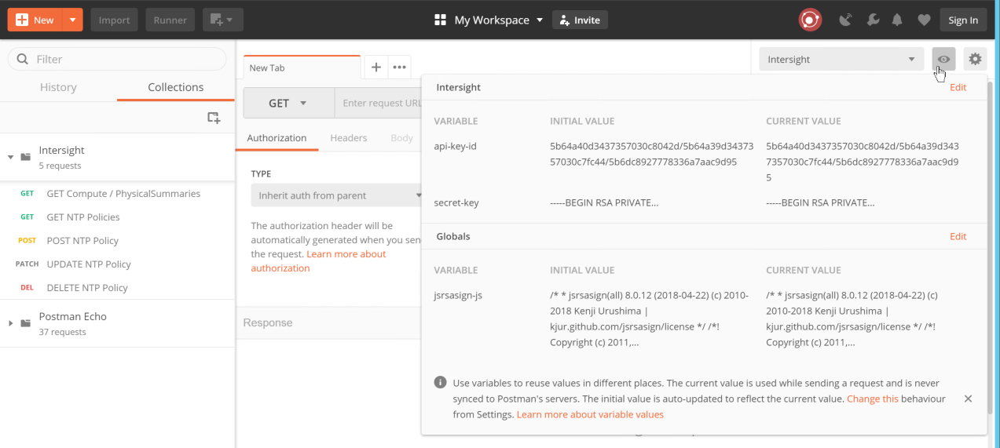
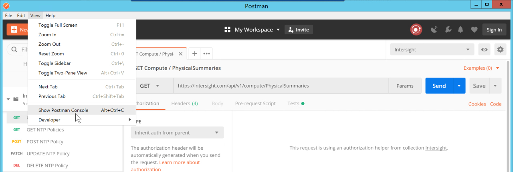
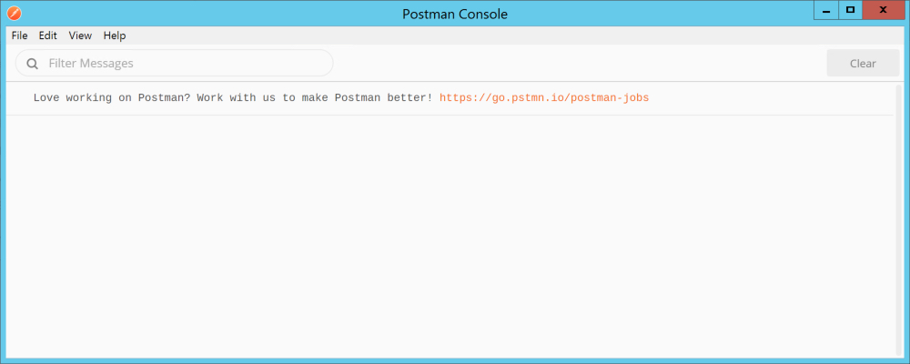
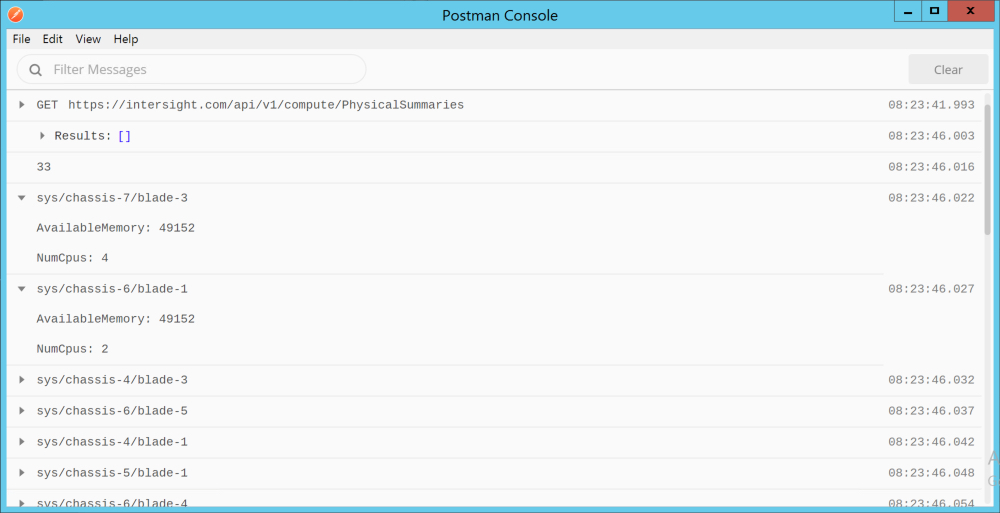

# Step 3: Use a Postman Collection to Interact with Cisco Intersight

### Create an Intersight Environment in Postman
The imported Intersight REST API Postman Collection is almost ready to be used.  You'll need to create a **Postman Environment** and populate two environment variables in order to make Intersight REST API calls via Postman.

1. Create a Postman Environment for Intersight

  - ***Click*** the "Eye" icon in the upper-right of the Postman interface.
  - ***Click*** "Add" in the upper-right of the "Environment" section.
  - ***Enter*** "Intersight" in the "Environment Name" field

      

2. Create Environment Variables for your REST API Keys

  - ***Enter*** the variable name `api-key-id` in the "VARIABLE" field.
  - ***Enter*** your **API Key ID** in the "INITIAL VALUE" field.

  The API Key ID is found under "Settings-->API Keys" in the Intersight interface.

  - ***Enter*** the variable name `secret-key` in the "VARIABLE" field.
  - ***Enter*** the entire contents of the `SecretKey.txt` file in the "INITIAL VALUE" field.

  The `SecretKey.txt` file is located in the directory `C:\Users\administrator\Downloads`. This file was downloaded when you created the API Keys in Intersight.

  - ***Click*** the "Add" button to create and save the environment.

      

  - ***Click*** the "X" in the upper-right of the "MANAGE ENVIRONMENTS" dialog.

### View the Intersight REST API Environment and open the Postman Console.

1. Select the Intersight Environment

  - ***Click*** the drop-down in the upper-right with the text "No Environment"
  - ***Select*** the "Intersight" environment

      

2. View the Intersight Environment variables

  - ***Click*** the "Eye" icon in the upper-right.

      

All of the Intersight requests with output to the Postman Console.

3. Open the Postman console

  - ***Click*** the "View" menu
  - ***Click*** the "Show Postman Console" menu item

      
      

With the Intersight Postman Environment created and Postman Console open you can now run the Intersight REST API requests and view results of the REST API calls.

### Make Intersight REST API Requests
1. Make the GET request for GET Compute / PhysicalSummaries

  - ***Click*** the **GET** request labeled `GET Compute / PhysicalSummaries`

  Notice the request Uri

  - `https://intersight.com/api/v1/compute/PhysicalSummaries`

  The **GET** is a query of the `compute/PhysicalSummaries` Intersight resource. The response is a JSON encoded listing of every Intersight managed compute resource in your account.

  - ***Click*** the "SEND" button

2. View the results in the Postman Interface and the Postman Console.

  - You can scroll through the results and view the `Moid` Managed Object ID for each compute resource. As well you can view a variety of attributes for each compute resource in your account.

      

  - The Postman Console was populated by both the Collect "Tests" and the GET request "Tests". View the JavaScript in the "Tests" to see how the individual resource attributes were accessed. 

      

**Congratulations! You've Completed, Introduction to the Cisco Intersight REST API with Postman**
