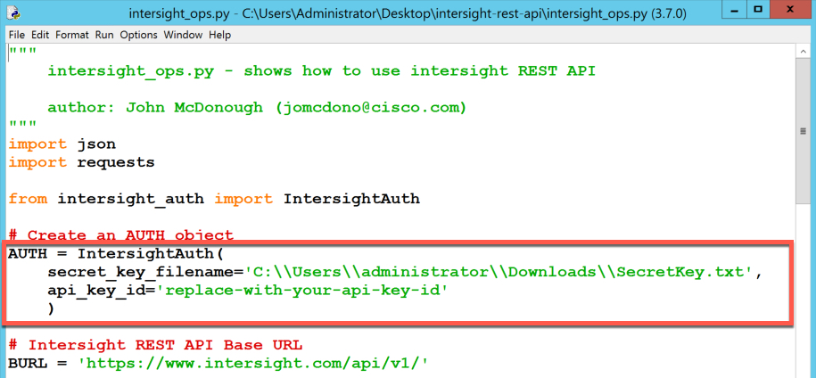

# Introduction to the Cisco Intersight REST API with Python

This Introduction to the Cisco Intersight REST API with Python Learning Lab will guide you through using REST APIs in Python to query, update and configure Intersight.

## Objectives

After completing this lab you will know:

- How to use REST APIs in Python to interact with Intersight.
- How to remove claimed devices from Intersight.

## Prerequisites
Prior to starting this learning lab, it would be helpful to have an understanding of Intersight functionality.

An understanding of REST, JSON and a bit of Python would also be helpful.

## Intersight REST API Documentation
Documentation for the Intersight REST API is available at [intersight.com](https://intersight.com/apidocs/introduction/overview/).

### Learning Lab infrastructure requirements
All the exercises in this lab can be completed using the [Cisco Intersight Sandbox](https://devnetsandbox.cisco.com/RM/Diagram/Index/a63216d2-e891-4856-9f27-309ca61ec862?diagramType=Topology).

## Step 1: Get the Python code

### Git the Python code from Github
If you have recently completed the **Cisco Intersight REST API with Postman** Learning Lab and are using the same DevNet Cisco Intersight Sandbox, then you already have the Python Intersight REST API Code in the `C:\Users\administrator\Desktop\intersight-rest-api` directory and can skip this procedure.

The Python Intersight REST API files are named:

  - `intersight_auth.py`
  - `intersight_ops.py`

Launch Git Bash to clone the Github repository for this Learning Lab's code.

1. Double-click the **Git Bash** shortcut on the desktop 
1. Enter `cd Desktop` to change directory to the Administrator's Desktop.
1. Enter `git clone https://github.com/movinalot/intersight-rest-api` to download the Intersight REST API Python code.

This creates an `intersight-rest-api` directory with the Intersight REST API Python source code, as well as the Postman collection for the Intersight REST API with Postman Learning Lab. You only need the Python source code for this Learning Lab. If you follow-up this lab with the Cisco Intersight REST API with Postman Learning Lab you do not have to re-clone the `intersight-rest-api` repository.

  <br/><br/>

### Open and update the Python Intersight REST API code

To open and Update the Intersight REST API code
1. Double-Click the `intersight-rest-api folder` on the desktop. 
1. Right-click the `intersight_ops.py` Python file.
1, Hover over then click the *second* menu option, **Edit with IDLE**. This will open the Python file `intersight_ops.py` in the Python 3.7 IDLE editor.

   <br/><br/>

1. Update the `secret_key_filename` variable with the location of the `SecretKey.txt` file that was downloaded from the Intersight interface. If you followed the Intersight REST API Learning Lab where you created the Intersight REST API Keys then the path to the `SecretKey.txt` file should match what is in the downloaded source code.

    `C:\\Users\\administrator\\Downloads\\SecretKey.txt`

1. Update the `api_key_id` variable with the API key ID from the Intersight interface.

   
   
   
   

### Code Explanation

#### Imports/Authentication/REST API URL
The code imports the `json` and `requests` python modules.
- The `json` module allows you to manipulate JSON data.
- The `requests` module provides the following `HTTP` method functions:
    - **GET**
    - **DELETE**
    - **PATCH**
    - **POST**
  - The `IntersightAuth` Class is imported from the `intersight_auth.py` python module.
  - The `IntersightAuth` Class is instantiated in as the `AUTH` object.
  - The constant `BURL` is the URL for the Intersight V1 REST API.

Intersight uses an authentication mechanism that *hashes* and *signs* the Intersight REST API request with your API keys. Prior to every Intersight REST API request, the `AUTH` object is called and the request is hashed and signed.

#### Intersight REST API Operations

```python
# intersight operations, GET, POST, PATCH, DELETE
OPERATIONS = [
    {
        "request_process":True,
        "resource_path":"compute/PhysicalSummaries",
        "request_method":"GET"
    },
    {
        "request_process":False,
        "resource_path":"ntp/Policies",
        "request_method":"GET"
    },
    {
        "request_process":False,
        "resource_path":"ntp/Policies",
        "request_method":"POST",
        "request_body":{
            "Enabled":True,
            "Name":"ntp-policy",
            "Description":"NTP Policy for ntp.org",
            "NtpServers":[
                "pool.ntp.org"
                ],
            "Tags":[]
        }
    },
    {
        "request_process":False,
        "resource_path":"ntp/Policies",
        "request_method":"POST",
        "request_body":{
            "Enabled":True,
            "Name":"ntp-policy-west",
            "Description":"NTP Policy for ntp.org West Coast",
            "NtpServers":[
                "0.pool.ntp.org",
                "1.pool.ntp.org"
                ],
            "Tags":[]
        }
    },
    {
        "request_process":False,
        "resource_path":"ntp/Policies",
        "request_method":"POST",
        "request_body":{
            "Enabled":True,
            "Name":"ntp-policy-east",
            "Description":"NTP Policy for ntp.org East Coast",
            "NtpServers":[
                "2.pool.ntp.org",
                "3.pool.ntp.org"
                ],
            "Tags":[]
        }
    },
    {
        "request_process":False,
        "resource_name":"ntp-policy",
        "resource_path":"ntp/Policies",
        "request_method":"PATCH",
        "request_body":{
            "NtpServers":[
                "pool.ntp.org",
                "10.10.10.30"
                ]
            }
    },
    {
        "request_process":False,
        "resource_name":"ntp-policy-east",
        "resource_path":"ntp/Policies",
        "request_method":"DELETE"
    }
]
```

`OPERATIONS` is a list of Python dictionaries. Each dictionary represents the input to an Intersight REST API call.

   - `request_process`: Should this request be processed?
   - `resource_path`: Object resource does the request acts upon.
   - `request_method`: What type of REST API request is being made on the resource?
   - `request_body`: What attributes are needed to create or update the resource? (Not required for `GET` or `DELETE`.)
   - `resource_name`: Name of the resource to be updated or deleted.

  The `OPERATIONS` are:

   - `GET compute/PhysicalSummaries`: Query all compute resources associated with your Intersight account.
   - `GET ntp/Policies`: Query all NTP Policies associated with your Intersight account
   - `POST ntp/Policies`: Create  an NTP Policy named `ntp-policy`.
   - `POST ntp/Policies`: Create an NTP Policy named `ntp-policy-west`.
   - `POST ntp/Policies`: Create an NTP Policy named `ntp-policy-east`.
   - `PATCH ntp/Policies`: Update NTP Policy named `ntp-policy`.
   - `DELETE ntp/Policies`: Delete an NTP Policy named `ntp-policy-east`.

  Processing the `OPERATIONS`

  ```python
  for operation in OPERATIONS:

      if operation['request_process']:

        response = None
        print(operation['request_method'])

        # GET
        if operation['request_method'] == "GET":
            response = requests.get(
                BURL + operation['resource_path'],
                auth=AUTH
                )

        # POST
        if operation['request_method'] == "POST":
            response = requests.post(
                BURL + operation['resource_path'],
                data=json.dumps(operation['request_body']),
                auth=AUTH
                )

        # PATCH
        if operation['request_method'] == "PATCH":

            # GET the Moid of the MO to PATCH
            response = requests.get(
                (
                    BURL + operation['resource_path'] +
                    "?$filter=Name eq '" + operation['resource_name'] + "'"
                    ),
                auth=AUTH
                )

            # Extract the Moid from the Results
            json_result = json.loads(response.text)
            moid = json_result["Results"][0]["Moid"]

            response = requests.patch(
                BURL + operation['resource_path'] + "/" + moid,
                data=json.dumps(operation['request_body']),
                auth=AUTH
                )

        # DELETE
        if operation['request_method'] == "DELETE":

            # GET the Moid of the MO to DELETE
            response = requests.get(
                (
                    BURL + operation['resource_path'] +
                    "?$filter=Name eq '" + operation['resource_name'] + "'"
                    ),
                auth=AUTH
                )

            # Extract the Moid from the Results
            json_result = json.loads(response.text)
            moid = json_result["Results"][0]["Moid"]

            response = requests.delete(
                BURL + operation['resource_path'] + "/" + moid,
                auth=AUTH
                )

        print(response)
        print(response.text)
  ```

  For each dictionary in the `OPERATIONS` list, if `request_process` is `True` set the variable `operation` to the current dictionary. Call the appropriate `requests` method based on the value of `request_method` in the `operation` dictionary.

  If the `request_method` is a **GET**

    - Use the `requests.get()` method
    - Set the REST API resource by appending the `resource_path` to the end of the Intersight REST API Base URL.
    - Supply the `AUTH` object as the authentication mechanism that the `requests.get()` method should use.

  ```python
  response = requests.get(
      BURL + operation['resource_path'],
      auth=AUTH
      )
  ```

  If the `request_method` is a **POST**

    - Use the `requests.post()` method
    - Set the REST API resource by appending the `resource_path` to the end of the Intersight REST API Base URL.
    - Set the `requests.post()` parameter `data` to the JSON encoded value of the `request_body`
    - Supply the `AUTH` object as the authentication mechanism that the `requests.post()` method should use.

  ```python
  response = requests.post(
      BURL + operation['resource_path'],
      data=json.dumps(operation['request_body']),
      auth=AUTH
      )
  ```

  If the `request_method` is a **PATCH**

    - Query Intersight for the `resource_name` using a **GET**
    - Encode the **GET** `response.text` as JSON
    - Extract from the **GET** request response the `Moid` (Intersight Managed Object ID) of the found object

    - Use the `requests.patch()` method
    - Set the REST API resource by appending the `resource_path` to the end of the Intersight REST API Base URL. Then appending to that the `Moid` of the existing object.
    - Set the `requests.patch()` parameter `data` to the JSON encoded value of the `request_body`
    - Supply the `AUTH` object as the authentication mechanism that the `requests.patch()` method should use.

  ```python
  response = requests.patch(
      BURL + operation['resource_path'] + "/" + moid,
      data=json.dumps(operation['request_body']),
      auth=AUTH
      )
  ```

  If the `request_method` is a **DELETE**

    - Query Intersight for the `resource_name` using a **GET**
    - Encode the **GET** `response.text` as JSON
    - Extract from the **GET** request response the `Moid` (Intersight Managed Object ID) of the found object

    - Use the `requests.delete()` method
    - Set the REST API resource by appending the `resource_path` to the end of the Intersight REST API Base URL. Then appending to that the `Moid` of the existing object.
    - Supply the `AUTH` object as the authentication mechanism that the `requests.delete()` method should use.

  ```python
  response = requests.delete(
      BURL + operation['resource_path'] + "/" + moid,
      auth=AUTH
      )
  ```

  At the end of the for each loop print:
    - `response` - provides the HTTP status code of the request
    - `response.txt` - provides the JSON encoded results

Next Step: Running the Python Code to Interact with Cisco Intersight.
