# Step 2: Running Python code to interact with Intersight

## Run each Intersight REST API request

### Run the GET request for compute/PhysicalSummaries
1. Click the **Run** menu in the IDLE Editor loaded with the `intersight_ops.py` code.
1. Click the **Run Module** option.

   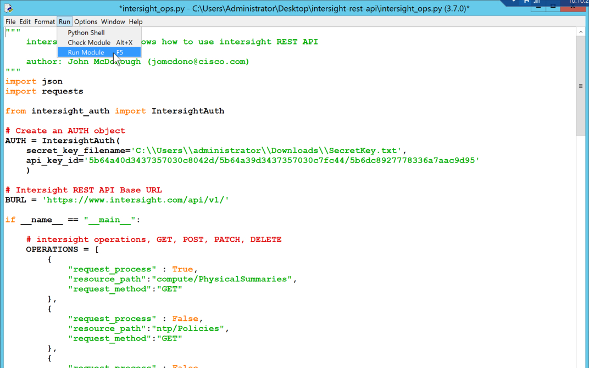<br/><br/>

1. Because `request_process` was set to `True`, the `GET` request will run. Provided your API keys were setup correctly, you should see output similar to the JSON response example below.

    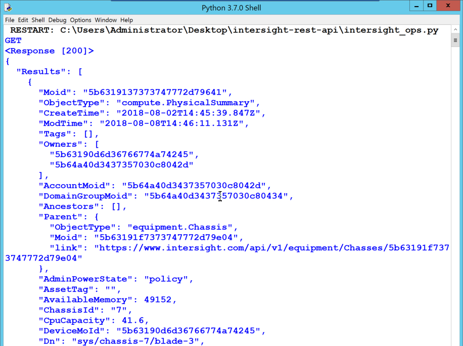<br/><br/>

### Run the GET request for ntp/Policies
1. Change the value of `request_process` for the previous `GET` request to `False`.
1. Change the value of `request_process` for this `GET` request to `True`.
1. Change the "Run" menu by clicking the **Run Module** option, then **Save** your code (if prompted).

   <br/><br/>

  The `GET` request should return `"Results" : null` as no NTP policies have been created yet.

  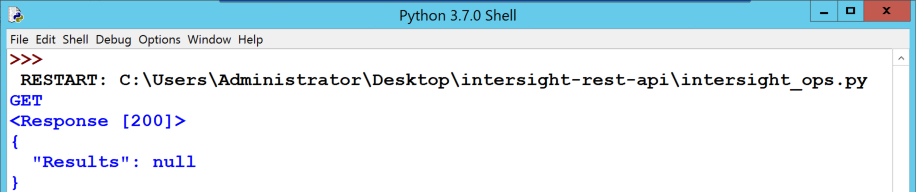<br/><br/>

### Run the POST request for ntp/Policies
1. Change the value of `request_process` for the previous `GET` request to `False`.
1. Change the value of `request_process` for this `POST` request to `True`.
1. In the **Run** menu, click the **Run Module** option and **Save** your code (if prompted). 

   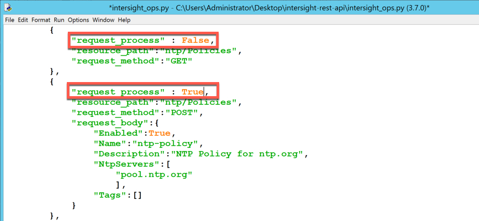

   The **POST** request creates the NTP Policy named `ntp-policy` defined by the JSON in `request_body`

   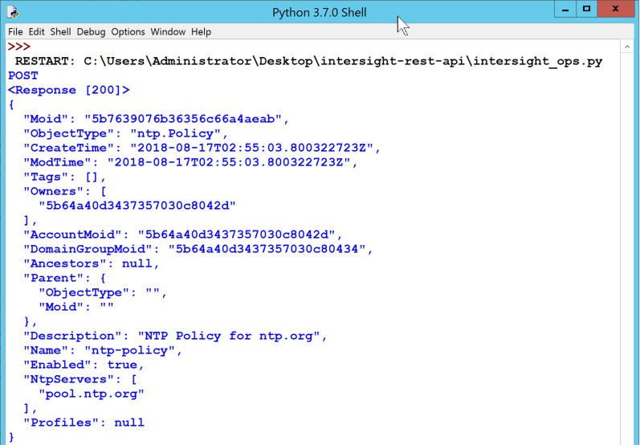

1. View this new NTP Policy in Intersight by navigating to **Policies-->Server Policies** and clicking on the `ntp-policy` policy name.

  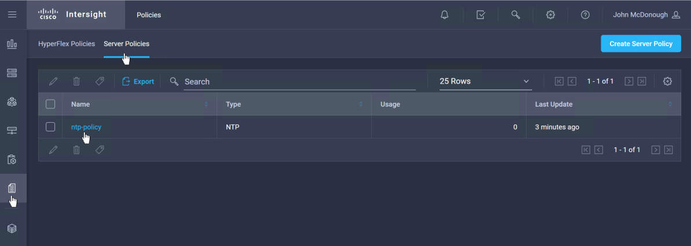
  
  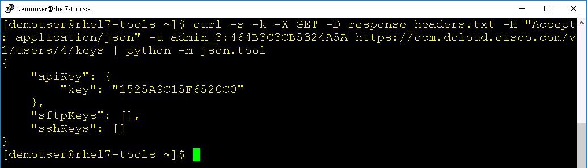

### Run two POST requests to create two additional NTP Policies

Next run two post commands to create `ntp-policy-east` and `ntp-policy-west`.

1. Change the value of `request_process` for the previous `POST` request to `False`.
1. Change the value of `request_process` for the two NTP Policies `POST` requests to `True`
1. Select the **Run Module** option from the **Run** menu and **Save** your code (if prompted). 

   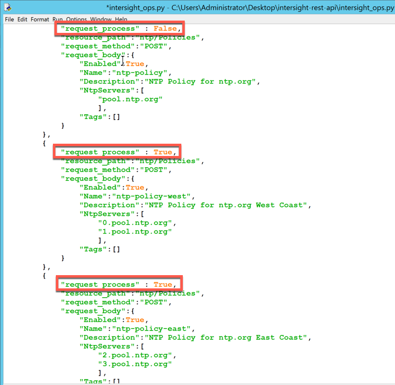<br/><br/>

1. The `POST` requests create two additional NTP Policies.
1. View the additional NTP Policies in Intersight.

### Run the PATCH request for ntp/Policies

  - ***Change*** the value of `request_process` for the previous **two POST** requests to `False`
  - ***Change*** the value of `request_process` for this **PATCH** request to `True`
  - ***Click*** the "Run" menu
  - ***Click*** the "Run Module" option
  - ***Save*** your code, if prompted<br/><br/>

  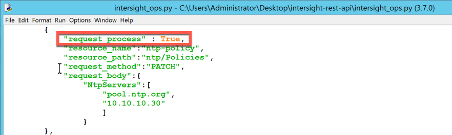<br/><br/>

  The **PATCH** request updates the NTP Policy named `ntp-policy` the update is defined by the JSON in `request_body`

  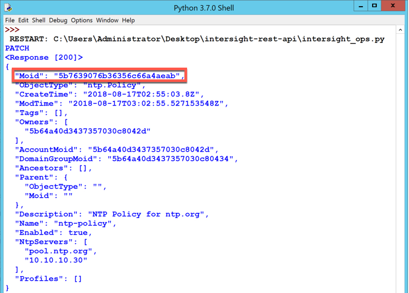<br/><br/>

  The `Moid` in the response is the `Moid` of the NTP Policy named `ntp-policy`.

  The **PATCH** process in the Python code first runs a **GET** request to retrieve the object for an NTP Policy named `ntp-policy`. This is done by building a `$filter` query on the request Url.

  The full Url with the query looks like this

  ```
  https://www.intersight.com/api/v1/npt/Policies?$filter=Name eq 'ntp-policy'
  ```

  The [Intersight API Guide](https://intersight.com/apidocs/introduction/query/) has extensive documentation on queries and the formatting of queries.

  - ***View*** the updated NTP Policy in Intersight and notice that there are now two NTP Servers shown for the Policy.<br/><br/>

  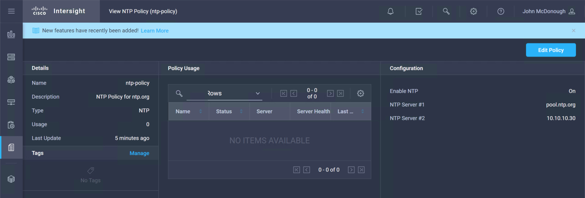<br/><br/>

6. Run the **DELETE** request for `ntp/Policies`

  - ***Change*** the value of `request_process` for the previous **PATCH** request to `False`
  - ***Change*** the value of `request_process` for this **DELETE** request to `True`
  - ***Click*** the "Run" menu
  - ***Click*** the "Run Module" option
  - ***Save*** your code, if prompted<br/><br/>

  The **DELETE** process in the Python code first runs a **GET** request to retrieve the object for an NTP Policy named `ntp-policy-east`. This is done by building a `$filter` query on the request Url.

  The full Url with the query looks like this

  ```
  https://www.intersight.com/api/v1/npt/Policies?$filter=Name eq 'ntp-policy-east'
  ```

  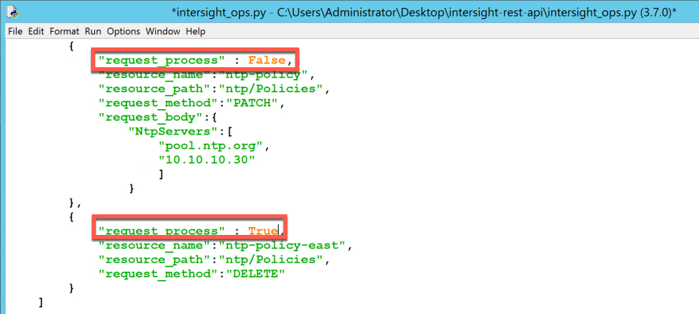<br/><br/>

  The **DELETE** request deletes the NTP Policy named `ntp-policy-east`. There is no response text only the response code. The response `<Response [200]>` indicates a successful delete operation.

  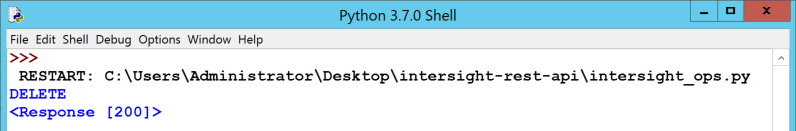<br/><br/>

  - ***View*** the NTP Policies in Intersight and notice that the `ntp-policy-east` policy has been deleted.<br/><br/>

  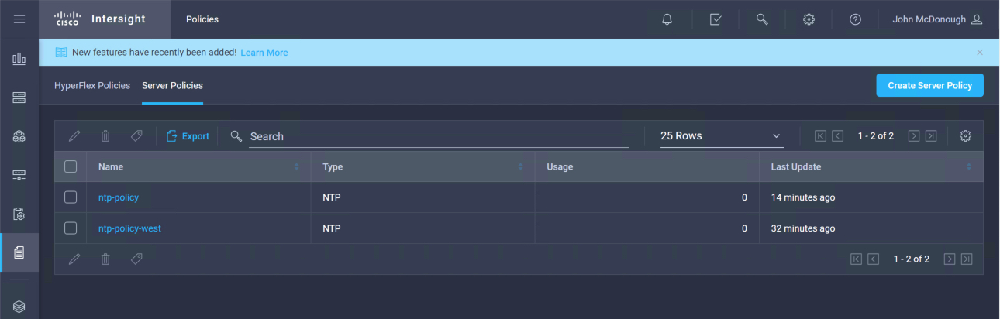<br/><br/>

Next Step: Removing Claimed UCS Devices from Intersight
