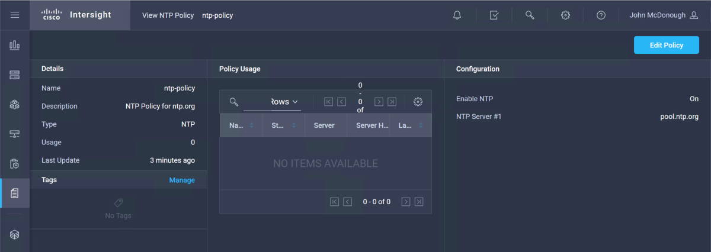

# Step 2: Running the Python Code to Interact with Cisco Intersight

### Run Each Intersight REST API Request

1. Run the **GET** request for `compute/PhysicalSummaries`

  - ***Click*** the "Run" menu
  - ***Click*** the "Run Module" option<br/><br/>

  Because `request_process` was set to `True` the **GET** request will run. Provided your API Keys were setup correctly you should see output similar to the JSON below.

    <br/><br/>

2. Run the **GET** request for `ntp/Policies`

  - ***Change*** the value of `request_process` for the previous **GET** request to `False`
  - ***Change*** the value of `request_process` for this **POST** request to `True`
  - ***Click*** the "Run" menu
  - ***Click*** the "Run Module" option
  - ***Save*** your code, if prompted<br/><br/>

  <br/><br/>

  The **GET** request should return a Null `Results` list as no NTP Policies have been created yet.

  <br/><br/>

3. Run the **POST** request for `ntp/Policies`

  - ***Change*** the value of `request_process` for the previous **GET** request to `False`
  - ***Change*** the value of `request_process` for this **POST** request to `True`
  - ***Click*** the "Run" menu
  - ***Click*** the "Run Module" option
  - ***Save*** your code, if prompted<br/><br/>

  <br/><br/>

  The **POST** request creates the NTP Policy named `ntp-policy` defined by the JSON in `request_body`

  <br/><br/>

  To view this new NTP Policy in Intersight

  - ***Navigate*** to "Policies-->Server Policies"
  - ***Click*** on the policy name `ntp-policy`<br/><br/>

  <br/><br/>
  <br/><br/>

4. Run the two **POST** requests to create two additional NTP Policies named

  - `ntp-policy-east`
  - `ntp-policy-west`

  - ***Change*** the value of `request_process` for the previous **POST** request to `False`
  - ***Change*** the value of `request_process` for the two NTP Policies **POST** requests to `True`
  - ***Click*** the "Run" menu
  - ***Click*** the "Run Module" option
  - ***Save*** your code, if prompted<br/><br/>

  <br/><br/>

  The **POST** requests create two additional NTP Policies.

  - ***View*** the additional NTP Policies in Intersight

5. Run the **PATCH** request for `ntp/Policies`

  - ***Change*** the value of `request_process` for the previous **POST** requests to `False`
  - ***Change*** the value of `request_process` for this **PATCH** request to `True`
  - ***Click*** the "Run" menu
  - ***Click*** the "Run Module" option
  - ***Save*** your code, if prompted<br/><br/>

  <br/><br/>

  The **PATCH** request updates the NTP Policy named `ntp-policy` the update is defined by the JSON in `request_body`

  <br/><br/>

  The `Moid` in the response is the `Moid` of the NTP Policy named `ntp-policy`.

  The **PATCH** process in the Python code first runs a **GET** request to retrieve the object for an NTP Policy named `ntp-policy`. This is done by building a `$filter` query on the request Url.

  The full Url with the query looks like this

  ```
  https://www.intersight.com/api/v1/npt/Policies?$filter=Name eq 'ntp-policy'
  ```

  The [Intersight API Guide](https://intersight.com/apidocs/introduction/query/) has extensive documentation on queries and the formatting of queries.

  - ***View*** the updated NTP Policy in Intersight and notice that there are now two NTP Servers shown for the Policy.<br/><br/>

  <br/><br/>

6. Run the **DELETE** request for `ntp/Policies`

  - ***Change*** the value of `request_process` for the previous **PATCH** request to `False`
  - ***Change*** the value of `request_process` for this **DELETE** request to `True`
  - ***Click*** the "Run" menu
  - ***Click*** the "Run Module" option
  - ***Save*** your code, if prompted<br/><br/>

  <br/><br/>

  The **DELETE** request deletes the NTP Policy named `ntp-policy-east`. There is no response text only the response code. The response `<Response [200]>` indicates a successful delete operation.

  <br/><br/>

  The `Moid` in the response is the `Moid` of the NTP Policy named `ntp-policy`.

  The **DELETE** process in the Python code first runs a **GET** request to retrieve the object for an NTP Policy named `ntp-polic-east`. This is done by building a `$filter` query on the request Url.

  The full Url with the query looks like this

  ```
  https://www.intersight.com/api/v1/npt/Policies?$filter=Name eq 'ntp-policy-east'
  ```

  - ***View*** the NTP Policies in Intersight and notice that the `ntp-policy-east` policy has been deleted.<br/><br/>

  <br/><br/>

Next Step: Removing Claimed UCS Devices from Intersight
